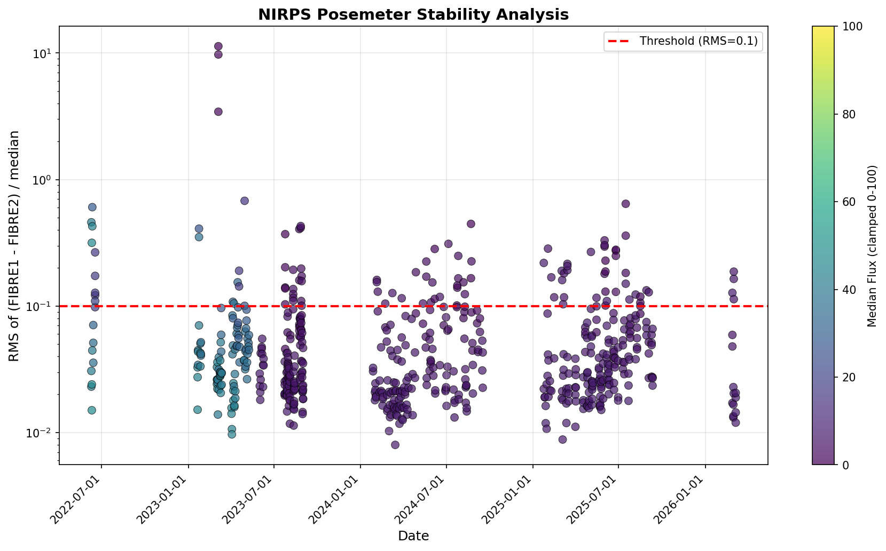
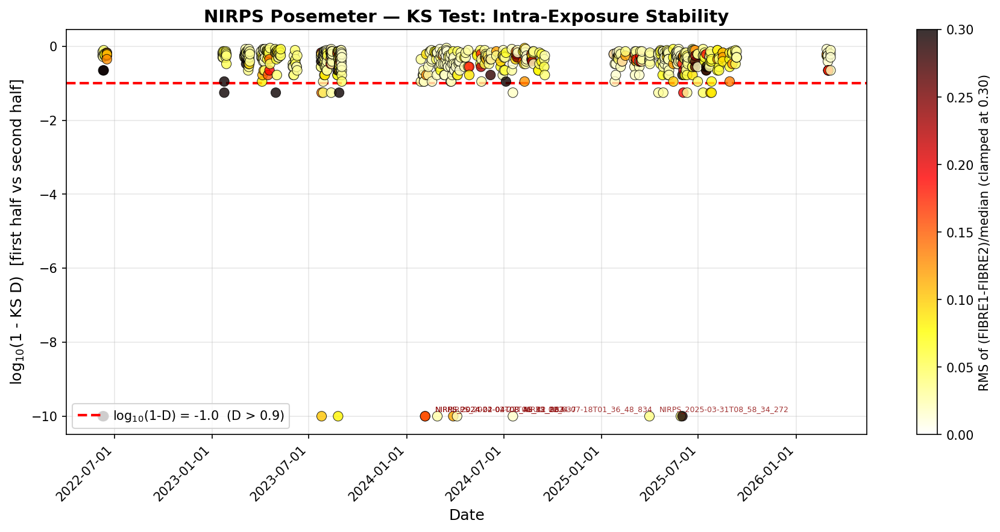
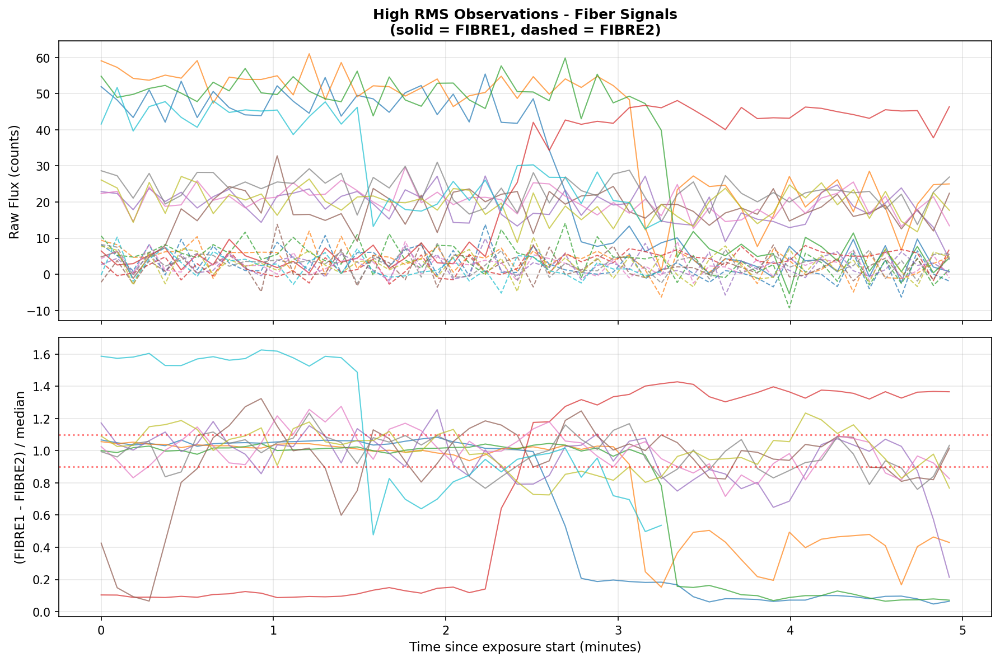

# NIRPS Posemeter Analysis

Tools to download, extract, and analyse posemeter data from **NIRPS** observations.

The posemeter records flux in two fibers (FIBRE1 and FIBRE2) throughout each exposure. Comparing the two fibers reveals guiding instabilities, cloud passages, and instrument artifacts in real time.

---

## Repository structure

```
nirps_posemeter/
├── config.yaml            # Analysis configuration (objects, thresholds, …)
├── extract_posemeter.py   # Extract the posemeter extension from full NIRPS FITS files
├── plot_posemeter.py      # Analyse extracted files and produce diagnostic plots
├── rsync2disk.scr         # Shell script to download posemeter files from the server
├── data/
│   ├── file_index.csv     # Auto-generated cache of FITS headers (built by plot script)
│   └── NIRPS_*_posemeter.fits   # Extracted posemeter files (ignored by git)
└── plots/                 # Output plots (generated by plot script)
```

---

## Quick start

### 1 — Download posemeter files

The script `rsync2disk.scr` pulls all extracted posemeter FITS files from the reduction server into `data/`:

```bash
bash rsync2disk.scr
```

It runs:

```bash
rsync -av --compress -e "ssh" spirou@rali:/space/spirou/posemeter/ data/
```

**Prerequisites**

- SSH access to the `rali` server as user `spirou`
- `rsync` available on your machine (`brew install rsync` on macOS if missing)
- Your public key authorised on the server (or be prepared to enter a password)

After the sync, `data/` will contain one `*_posemeter.fits` file per NIRPS observation.

---

### 2 — (Optional) Extract posemeter from full NIRPS files

If you have the full, multi-extension NIRPS FITS files locally instead of the pre-extracted posemeter files, use `extract_posemeter.py` to pull out the posemeter extension:

```bash
# Single file
python extract_posemeter.py /path/to/NIRPS_2022-05-05T02_31_39_200.fits

# Batch with a wildcard
python extract_posemeter.py "/data/raw/NIRPS_*.fits" -o data/
```

The script:
- Reads the `POSEMETER` binary-table extension from each input file
- Keeps the primary header intact
- Writes a compact `*_posemeter.fits` file to the output directory
- Skips files that have already been extracted

```
usage: extract_posemeter.py [-h] [-o OUTPUT_DIR] input_pattern

positional arguments:
  input_pattern   Path to the input FITS file(s). Supports wildcards (e.g., '*.fits')

options:
  -o OUTPUT_DIR   Output directory (default: /space/spirou/posemeter/)
```

---

### 3 — Analyse and plot

```bash
python plot_posemeter.py
```

The script:
1. Scans `data/NIRPS_*_posemeter.fits`
2. Builds (or updates) a fast header cache at `data/file_index.csv` so subsequent runs do not re-open every FITS file
3. Filters files by object name and rejects known calibrations (FLAT, WAVE, FP, …)
4. For each observation computes:
   - **MED** — median of (FIBRE1 − FIBRE2), a proxy for total flux
   - **RMS** — standard deviation of the normalised fiber difference, a proxy for guiding stability
   - **KS statistic** — Kolmogorov–Smirnov D-statistic between the first and second half of the time series, sensitive to systematic trends
5. Writes diagnostic plots to `plots/`

---

## Configuration (`config.yaml`)

```yaml
# Object names to keep — leave empty ([]) to process all non-calibration targets
objects:
  - Proxima

# Discard the first sample of each posemeter series (removes settling spikes)
reject_first_point: True

# Observations with median flux below this value are skipped
min_flux_threshold: 0.1

# RMS above this value is flagged and shown in the offenders plot
high_rms_threshold: 0.1
```

Edit `config.yaml` before running `plot_posemeter.py`. No code changes required.

### Filtering to a specific object

Set the `objects` list to one or more target names exactly as they appear in the FITS `OBJECT` keyword.

**Single target:**
```yaml
objects:
  - Proxima
```

**Multiple targets:**
```yaml
objects:
  - Proxima
  - GJ1002
  - TRAPPIST-1
```

**All science targets (no filter):**
```yaml
objects: []
```

Objects whose names contain any of the calibration keywords (`FLAT`, `WAVE`, `FP`, `DARK`, `LED`, `SKY`, `TELLURIC`, `ORDERDEF`, `CONTAM`) are **always** excluded, regardless of the `objects` list.

If you are unsure of the exact object name in the headers, inspect the auto-generated index:
```bash
# List all unique object names found on disk
python - <<'EOF'
import csv
with open('data/file_index.csv') as f:
    names = sorted({row['object'] for row in csv.DictReader(f)})
for n in names:
    print(n)
EOF
```

---

## Dependencies

| Package | Purpose |
|---------|---------|
| `astropy` | FITS I/O, time handling, table operations |
| `numpy` | Numerical computation |
| `scipy` | KS-test statistic |
| `matplotlib` | Plots |
| `pyyaml` | Config file parsing |

Install everything at once:

```bash
pip install astropy numpy scipy matplotlib pyyaml
```

---

## Output plots

Plots are saved to `plots/` after each run of `plot_posemeter.py`.

### Summary — RMS vs date

RMS of the normalised fibre difference over time, colour-coded by median flux level. Each point is one observation. High-RMS points are flagged.



### KS-test statistic

Kolmogorov–Smirnov D-statistic comparing the first and second halves of each posemeter time series. A large D-statistic indicates a systematic trend or drift within the exposure.



### Offenders — detail view

Close-up of every observation whose RMS exceeds `high_rms_threshold`. Useful for diagnosing guiding failures or cloud passages.


